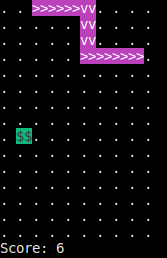

# Snake
Simple terminal based snake game made using ncurses.
## Compile & Run
To compile into `build` directory using `make` run
```sh
cmake -B build
make -C build
```
or if you prefer to use `ninja` run
```sh
cmake -B build -GNinja
ninja -C build
```
Either case the output binary would be inside `build` directory. To run it without changing current directory run
```sh
./build/snake
```

## Preview

